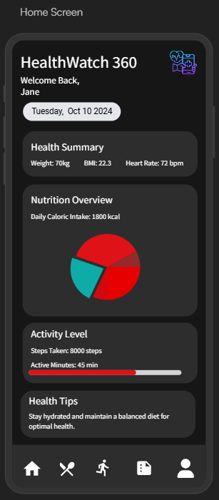
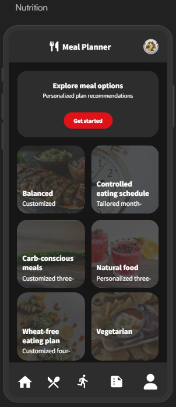
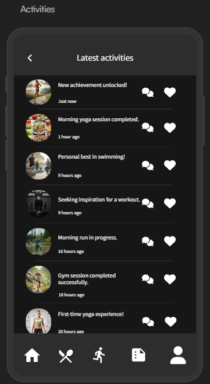
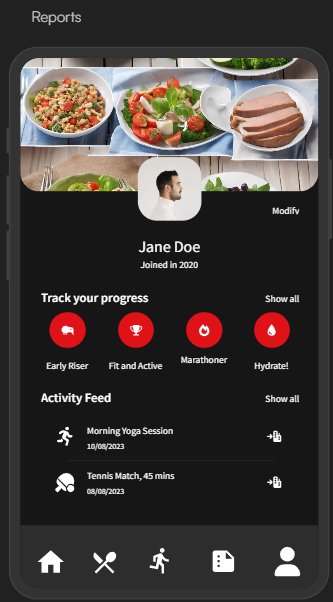
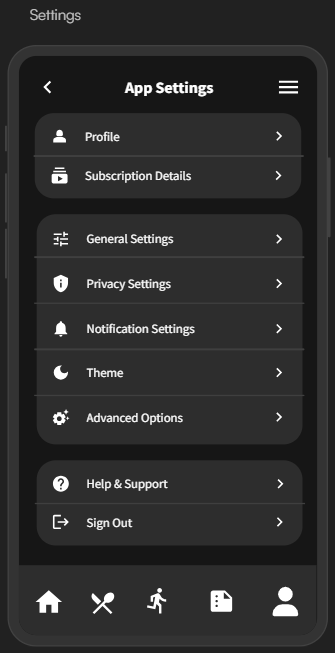

# HealthWatch 360

Rhiannon Wallace, Sam Moushey, Megha Pawar, Bengeo George, Sahana Sathiyanarayanan

## Introduction

HealthWatch 360 is a mobile application that helps individuals monitor and improve their overall health and wellness.  

By integrating health risk statistics and nutritional data, HealthWatch 360 enables users to:
* Track lifestle habits
* Assess potential health risks
* Receive personalized healthcare recommendations
  
The app is designed for those looking to take control of their health with data-driven insights, empowering users to make better lifestyle choices and prevent common health issues like heart disease, diabetes, and obesity. 

## Logo

## Story Board

1. Home Screen: Displays an overview of the user's health data, including nutrition intake, activity levels, and key health metrics. 
2. Health Risk Analysis: A dashboard where users can view health risk assessments based on their data and local health statistics from CDC. 
3. Nutrition Tracker: Allows users to log their meals and receive recommendations based on USDA food data. 
4. Exercise & Activity Tracking: Users can log daily exercise and track their activity levels. 
5. Health Reports: Users can generate weekly or monthly reports on their health and progress toward goals. 

    
## Requirements

## Data Sources

[CDC Health Data](https://data.cdc.gov/)  
[USDA FoodData Central](https://fdc.nal.usda.gov/fdc-app.html#/food-search?type=Foundation&query=)

## Development Team
- Rhiannon Wallace
- Sam Moushey
- Megha Pawar
- Bengeo George
- Sahana Sathiyanarayanan

## Meeting Schedule
[we will talk this thru]

