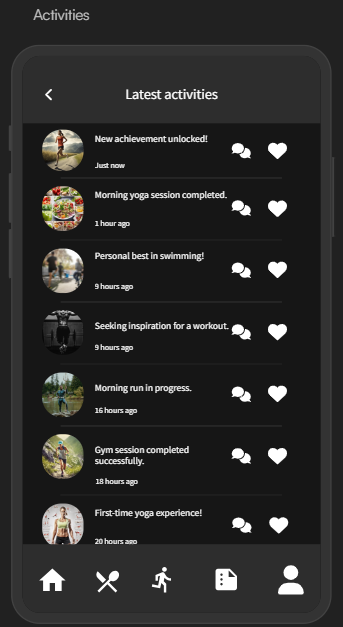

# HealthWatch 360

Rhiannon Wallace, Sam Moushey, Megha Pawar, Bengeo George, Sahana Sathiyanarayanan

## Introduction

HealthWatch 360 is a mobile application designed to help individuals monitor and improve their overall health and wellness. 
By integrating health risk statistics and nutritional data, the app empowers users to make informed lifestyle choices, aiming to prevent common health issues such as heart disease, diabetes, and obesity.

HealthWatch 360 enables users to:
* Track Lifestyle & Exercise Habits
* Assess Potential Health Risks
* Discover Local Exercise Centers
* Personalized Health Goals
* Health Reports
  
The app is designed for those looking to take control of their health with data-driven insights, empowering users to make better lifestyle choices and prevent common health issues like heart disease, diabetes, and obesity. 

## Logo

## Story Board

1. Home Screen: Displays an overview of the user's health data, including nutrition intake, activity levels, and key health metrics. 
2. Profile Page: Users create and manage profiles, inputting personal details like age, gender, height, weight, and zip code.
3. Exercise & Activity Tracking: Log daily exercises, track activity levels, view calories burned, and see exercise centers visited.
4. Local Exercise Centers: Display nearby exercise facilities to help achieve fitness goals.
5. Health Reports: Generate and view weekly or monthly health reports and progress towards goals.

    

## Requirements
 

### Requirement #1: Tracking Daily Nutrition
*As a user, I want to track my nutritional intake so I can monitor my health more efficiently.*

#### Dependencies:
* User authentication for personal meal tracking
* User knows the nutrient information of their food
* Ability to allow for easy search and logging of meals
  
#### Assumptions:
* Nutrition statistics page provides up-to-date and accurate nutritional data
* User understands the nutrient information of the food they are consuming
* Nutrition statistics page provides a sufficient coverage of food items applicable to users

##### Examples:
1.1 
**Given** the user eats hummus  
**When** the user logs hummus nutrients,  
**Then** the app should automatically calculate the total calories and nutrient for the day using the logged in nutrient information as its source.

2.1  
**Given** the user is tracking their food intake,  
**When** the daily sodium level exceeds the recommended amount,  
**Then** the app will display a notification that the user should reduce their sodium intake to better manage their health.
 
 
 

### Requirement #2: Personalized Health Goals
*As a user, I want to set personal health goals so that I can stay motivated and track my progress over time.*

#### Dependencies:
* Goal-setting feature within the app
* Progress tracking and visualization tools (e.g., charts, milestones)
* Notifications and reminders system

#### Assumptions:
* Users are interested in setting and achieving personal health goals
* The app can accurately track progress towards these goals
* Users will engage with reminders and notifications

#### Examples:
1.1  
**Given** the user wants to improve their cardiovascular health,  
**When** the user sets a goal to run 5 kilometers without stopping within two months,  
**Then** the app should provide a training plan, track the user's runs, and display progress updates.

2.1  
**Given** the user aims to reduce daily sugar intake,  
**When** the user sets a nutritional goal to consume less than 25 grams of sugar per day,  
**Then** the app should monitor the user's food logs and alert them when they are approaching their daily limit.
 
 
 

### Requirement #3: Personalized Health Recommendations and Assessment
*As a user, I want to receive personalized recommendations so that I can improve my health based on my tracked data and region's data.*

#### Dependencies:
* Analytics engine to interpret user data
* Access to reliable health programs and recreational activities (e.g., City of Cincinnati)
* Content management system for delivering recommendations

#### Assumptions:
* Users are open to receiving health recommendations
* The app can accurately analyze user data to provide relevant suggestions
* Recommendations are tailored to individual user profiles and preferences

#### Examples:
1.1  
**Given** the user recognizes that they are a smoker,  
**When** the user creates a goal to quit smoking  
**Then** the app will display a personalized set of activites and resources to quit smoking based on the user's zipcode.

2.1  
**Given** the user shows a trend of working out via sports,  
**When** the app detects more than three sport-based workouts,  
**Then** a user will be recommended a set of locations with sports available and local sports programs.
 
 
 

### Requirement #4: Medication Tracking and Reminders
*As a user, I want to track my medication intake and receive reminders so that I can adhere to my prescribed schedule.*

#### Dependencies:
* Medication database with dosing schedules
* Reminder and notification system
* User interface for logging medication intake

#### Assumptions:
* Users are willing to input their medication schedules
* The app can send timely notifications
* Users will interact with reminders (e.g., mark as taken, snooze, or no longer taking this medication)

#### Examples:
1.1  
**Given** the user is prescribed Chateal EQ (or another birth control pill) to be taken once daily,  
**When** the user inputs the name and time the medication should be taken into the app,  
**Then** the app will then send a reminder one hour before the specified time and will request the user to confirm when the medication is consumed.

2.1  
**Given** the user missed a medication dose,  
**When** the user does not confirm intake within 30 minutes of the scheduled time,  
**Then** the app will send a follow-up notification stating the medication has not been taken and will automatically mark the missing does in the medication log.

## Data Sources
[Cincinnati Creating Health Communities Coalition Activities](https://data.cincinnati-oh.gov/Thriving-Neighborhoods/Creating-Healthy-Communities-Coalition-CHCC-Activi/skqm-k58y/about_data)  
[Cincinnati Recreation Commission Listing](https://data.cincinnati-oh.gov/Thriving-Neighborhoods/Cincinnati-Recreation-Commission-Facility-Listing/vset-45gc/about_data)

## Development Team
- Rhiannon Wallace
- Sam Moushey
- Megha Pawar
- Bengeo George
- Sahana Sathiyanarayanan

## Meeting Schedule
* Semester: Fall 2024 - Flex II
* Meeting Time & Location: Mondays at 1:00pm via Microsoft Teams

