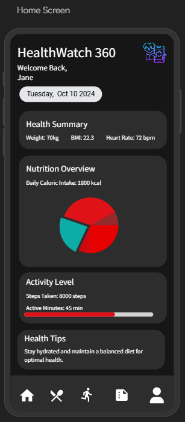
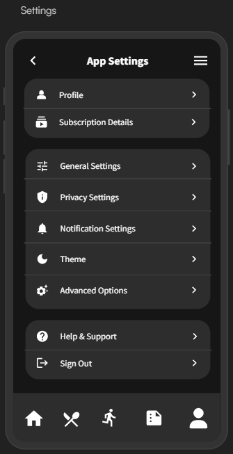

# HealthWatch 360

Rhiannon Wallace, Sam Moushey, Megha Pawar, Bengeo George, Sahana Sathiyanarayanan

## Introduction

HealthWatch 360 is a mobile application designed to help individuals monitor and improve their overall health and wellness. 
By integrating health risk statistics and nutritional data, the app empowers users to make informed lifestyle choices, aiming to prevent common health issues such as heart disease, diabetes, and obesity.

HealthWatch 360 enables users to:
* Track Lifestyle & Exercise Habits
* Assess Potential Health Risks
* Discover Local Exercise Centers
* Personalized Health Goals
* Health Reports
  
The app is designed for those looking to take control of their health with data-driven insights, empowering users to make better lifestyle choices and prevent common health issues like heart disease, diabetes, and obesity. 

## Logo

## Story Board

1. Home Screen: Displays an overview of the user's health data, including nutrition intake, activity levels, and key health metrics. 
2. Profile Page: Users create and manage profiles, inputting personal details like age, gender, height, weight, and zip code.
3. Exercise & Activity Tracking: Log daily exercises, track activity levels, view calories burned, and see exercise centers visited.
4. Local Exercise Centers: Display nearby exercise facilities to help achieve fitness goals.
5. Health Reports: Generate and view weekly or monthly health reports and progress towards goals.

    

## Requirements
 

### Requirement #1: Tracking Lifestyle & Exercise Habits
*As a user, I want to track my lifestyle and exercise habits so that I can monitor my health and progress toward my fitness goals.*

#### Dependencies:
* Secure user authentication.
* User interface for logging daily activities and exercises.
* Database of exercise types with calorie burn rates.
* Access to location services for tracking visited exercise centers.
  
#### Assumptions:
* Users will regularly input their lifestyle and exercise data.
* The app provides an intuitive interface for easy logging.
* Calorie calculations are personalized based on user profiles.

##### Examples:
1.1 
**Given** the user completes a 5-mile run  
**When** they log this activity  
**Then** the app calculates the calories burned and updates their exercise statistics.

2.1  
**Given** the user visits a new exercise center  
**When** the app detects this via location services  
**Then** it logs the visit and adds the center to their list of visited facilities
 
 
 

### Requirement #2: Providing Nutrition Facts About Food
*As a user, I want to get nutritional information about the food I eat so that I can make healthier dietary choices.*

#### Dependencies:
* Integration with USDA food database for accurate nutritional data.
* Search and logging functionality for meals.
* Ability to calculate daily nutritional intake and compare it with recommended values.

#### Assumptions:
* Users are motivated to log their meals accurately.
* The food database covers a wide range of foods.
* Users have access to the internet to fetch the latest data.

#### Examples:
1.1  
**Given** the user eats a bowl of oatmeal with fruits  
**When** they log this meal  
**Then** the app displays the total calories and nutrient content, updating their daily intake

2.1  
**Given** the user exceeds the recommended daily sodium intake  
**When** they view their nutrition summary  
**Then** the app alerts them and suggests ways to reduce sodium consumption.
 
 
 

### Requirement #3: Analyzing Zip Code for Nearby Exercise Centers
*As a user, I want the app to find nearby exercise centers based on my zip code so that I can easily access fitness facilities to fulfill my exercise schedule and goals.*

#### Dependencies:
* Database or API access to local exercise centers and gyms.
* Geolocation services to map facilities relative to the user’s location.
* User profile containing zip code information.

#### Assumptions:
* Users provide accurate zip code information.
* The database of exercise centers is current and comprehensive.

#### Examples:
1.1  
**Given** the user lives in zip code 12345  
**When**  they search for nearby exercise centers as per their choice of excercise  
**Then** the app displays a list of exercise centers within a 10-mile radius, including contact information and directions.

2.1  
**Given** the user wants to find a swimming pool  
**When** they apply this filter,  
**Then** he app shows only the facilities that have swimming pools.
 
 
 

## Data Sources
[Cincinnati Creating Health Communities Coalition Activities](https://data.cincinnati-oh.gov/Thriving-Neighborhoods/Creating-Healthy-Communities-Coalition-CHCC-Activi/skqm-k58y/about_data)  
[Cincinnati Recreation Commission Listing](https://data.cincinnati-oh.gov/Thriving-Neighborhoods/Cincinnati-Recreation-Commission-Facility-Listing/vset-45gc/about_data)

## Development Team
- Rhiannon Wallace
- Sam Moushey
- Megha Pawar
- Bengeo George
- Sahana Sathiyanarayanan

## Meeting Schedule
* Semester: Fall 2024 - Flex II
* Meeting Time & Location: Mondays at 1:00pm via Microsoft Teams

